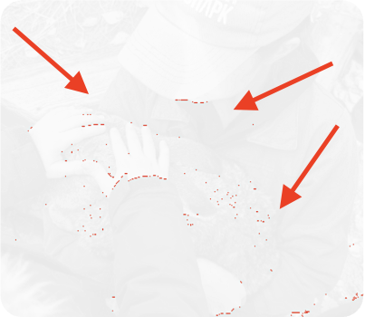

# Testing Strategy
We are aimed at building reliable, accessible, and maintainable software. To achieve this, we follow Test-Driven Development (TDD) principles, writing tests before implementation code.

## Objective
Our goal is to test every feature we build from the start to make sure it works correctly, looks right, and is accessible to everyone. This helps us find problems early and keep our software stable.

## Parallel Execution of Tests
All tests must support concurrent parallel invocation. The only exception is end-to-end tests which run one after the other. The reason is that we emulate the user's interaction with Strapi CMS, which reloads the page on save. So, saving some data in one test will cause the other E2E tests to fail if we try to run them in parallel. And we have no control of this behavior.

ToDo
- issue on github

## Types of Tests
| Type    | Target | Run Against Prod | Use Real DB | Need Data Cleanup | Tools |
| -------- | ------- | ------- |------- |------- |------- |
| E2E  | UI & CMS Integration   | No*    | Yes    | Yes (?)   | Playwright |
| Screenshot |   UI   | No    | No    | No    | Playwright |
| Unit    | Functions (Preview mode, Filter, Sort)   | No    | No    | No    | Jest |
| Component    |  Components narrow functionality  | No    | No    | No    | Playwright |
| Accessibility    |  UI Accessibility (WCAG AA) | No    | No    | No    | Playwright, Axe-core |
| Types Linting    | API Contract Safety | No    | No    | No    | TypeScript |
| API   | API Response | No    | No    | No    | Playwright |

*impossible to run in one tenant

ToDo
- monitoring tests (jMeter, lighthouse. robots.txt, валидации кеширования изображений?)
- move details to appendix? e.g. parallel running; typical features; screenshots

### E2E

#### Why do we write these tests?
We want to test the happy path of the content manager's work with CMS: filling the content in the admin panel, saving and publishing changes, and expecting to see them on UI. 

#### When do we write these tests?
We write E2E tests when we add a new integration with CMS in order to check that requests to the following will be displayed on UI correctly:
- Single Types in terms of Strapi CMS, such as home page, layout;
- Collection Types in terms of Strapi CMS, such as navigation, news list, portfolio.

#### What we test
We test only the happy path - the core business flow. We limit the number of E2E tests to only the core business flow to avoid falling back into the situation when we test every change with a coarse-grained tests when it is an overkill and a lighter more fine-grained test is enough. Time to run the tests is also a limitation factor.

Alongside the happy path, we also test SEO that is set in the CMS to make sure it is applied in HTML tree of the page.

All E2E tests are executed against Local Env. We don't test against Prod because it is too risky to lose client's data. It may be more or less safe to test Collection Types because we add a new entry and it doesn't affect the rest of the entries. But this is not the case with Single Types.

#### What we don't test
Edge cases with different deviations of input data.

For example, when a content manager creates a news article entry, fills only the title, but leaves the content body, image, and publication date empty and publishes the incomplete entry.

### Screenshot Testing

#### Why do we write these tests?
We aim at creating a stable robust UI and want keep it under control when the project is growing. We want to make sure that new components or pages don't affect the existing ones.</br>
We also want to test manually as little as possible, including the stage of design conformance.

#### When do we write these tests?
Everytime we start to write HTML and add styles for a component.</br>
Besides, in case you need to update the component, you need to regenerate its screenshot so it was up-to-date with the component's new appearance.

You can have a look at the flow of a component's screenshot testing based on the TDD approach [here](https://github.com/TourmalineCore/pelican-documentation/blob/master/architecture%20decision%20records/%D0%9F%D1%80%D0%BE%D1%86%D0%B5%D1%81%D1%81%20%D0%B2%D0%B5%D1%80%D1%81%D1%82%D0%BA%D0%B8%20%D1%87%D0%B5%D1%80%D0%B5%D0%B7%20TDD.md).

#### What we test
Components with static data.</br>
If a component has several states, we can test all of them with screenshots, e.g. an accordion in both collapsed and open state.

We test components on all regular breakpoints: mobile, tablet, tablet-xl, desktop, desktop-xl.

#### What we don't test
We don't test on real dynamic data as it is too unpredictable. </br>
We disable animations if they are present and disable autoplay for a video to make it static.</br>
We don't test components' behavior.</br>
We don't test components between the breakpoints.</br>
We don't test in all browsers, only in Chrome.</br>

#### Stubs for images
If there is an image part of a component, we substitute the image with an image stub, because there have been many flacks with images in screenshot testing, when random pixels where red showing discrepancies that are not distinguishable with the human eye. Using a stub we no longer get this problem, the image is always the same. 




#### Threshold
Playwright offers several options to configure the tolerance for differences in the toHaveScreenshot() assertions: maxDiffPixels / maxDiffPixelRatio.
However, we set the threshold to 0, because

*ToDo*</br>
+add link to the document with flow</br>
-experiment with the rest of browsers</br>
+image mocks</br>
+-threshold</br>

### Unit Testing

ToDo</br>
+definition</br>
+is it really easier to write them?</br>
+functions in isolation on mocks</br>
+example with screenshots</br>

A unit test is an isolated test of individual functionality that checks edge cases without external dependencies such as e.g. CMS or databases, and uses mocks, not real data. It verifies logic that is too expensive for E2E but doesn't test full workflows or UI.

E.g., here we check swiching locale to Chinese:
```JavaScript
  test(`
    GIVEN locale = zh
    WHEN getLayoutData is called with this locale
    THEN query string should contain locale en
    `, async () => {
    await getLayoutData({
      locale: `zh`,
    });

    expect(mockedApiFetch)
      .toHaveBeenCalledWith(
        expect.stringContaining(`locale=en`),
      );
  });
```

#### Why do we write these tests?
Here we can test functionality which we don't normally test in E2E, because it may not be a part of the happy path scenario, including edge cases. 
These tests are easy to write and maintain: you only test one function, not an entire user journey, with no external dependencies.
They are also faster and less demanding in terms of resources than E2E.

#### When do we write these tests?
When we need to test some minor functionality that is too expensive to test in E2E. With unit tests we don't need to run CMS, database, or other extra dependencies, and can check such functionality in isolation. 

#### What we test
Such functionality as e.g. calculations, requests to CMS (Preview mode, Filtration, Sorting). 

#### What we don't test
The work of the application as a whole and its UI. 

### Component Testing

#### Why do we write these tests?
Some components involve some business logic, e.g. validations, filtration, etc. We need to check that this logic is correct and doesn't break as the project evolves. E.g., to make sure that a request is triggered on click (query parameter is added?).

#### When do we write these tests?
We write such tests following TDD approach when we develop a component once we want to implement its specific behavior.

#### What we test
Component's behavior in isolation.

Edge cases, such as: 
- validations
- disabling / enabling a button
- filtration
- sorting

### Accessibility Testing

#### Why do we write these tests?
We want our application to be accessible to all categories of users, including those with temporary or permanent limitations. Ensuring accessibility is an integral part of our development process, so we need to test it just like any other functionality. 

#### When do we write these tests?
Tests involving *axe-core* can be integrated at the start of the project to follow the TDD approach.
Tests on correct keyboard navigation and focus visibility are written after the page is ready, because we need all the interactive elements to be present on the page to be able to test them.

#### What we test
1. Axe-core
- sufficient color ratio,
- alt attributes,
- labels,
- etc. </br>
These checks are based on [WCAG principles](https://www.w3.org/WAI/standards-guidelines/wcag/), level AA.
2. Correct keyboard navigation
3. Focus visibility of interactive elements

#### What we don't test
We don't autotest: 
- work of screenreaders such as VoiceOver or NVDA,
- usability,
- content.

These checks are done manually.

### Types Linting

This is a static type of testing which allows to automatically check the contract between UI & Backend.

Response types are generated based on Swagger with the help of [*swagger-typescript-api* package](https://www.npmjs.com/package/swagger-typescript-api). We use these types in responses and if there is any change on backend, e.g. a field is added or deleted, we will see this immediately in the IDE or pipeline when the test fails. 
This type of testing also ensures that we correctly map the data from backend to use it in UI components.

ToDo
-  client experiment -> add note why we dont generate client

#### Why do we write these tests?
Vanilla Javascript doesn't support types, whereas we use TypeScript to make our code stable and predictable. So we need a way to make sure we use the correct types.

#### When do we write these tests?
Once we coordinate the contract between UI & backend, we need to create the types for this contract. Here is when we can employ types linting.

#### What we test
- data mapping
- contract between UI & backend

### API Tests

#### Why do we write these tests?
We want to make sure that there are all necessary fields in the API response. This way we are certain that the structure we set in the CMS is correct. 

#### When do we write these tests?
Here we step away from the TDD principles, because it is not easy to think through the structure of the CMS component without creating it in the CMS first. 

So after we have added a Single type or Collection type, we can add the test to check its structure.
To validate the JSON schema of the response we use [*Zod* package](https://www.npmjs.com/package/zod).

#### What we test
API response - all the fields that are used in UI. 

#### What don't we test
The fields that are not used in UI are as a rule omitted.

ToDo:
Example: we need to add a section to the page - what kind of tests do we need and in what amount? what is the scenario?